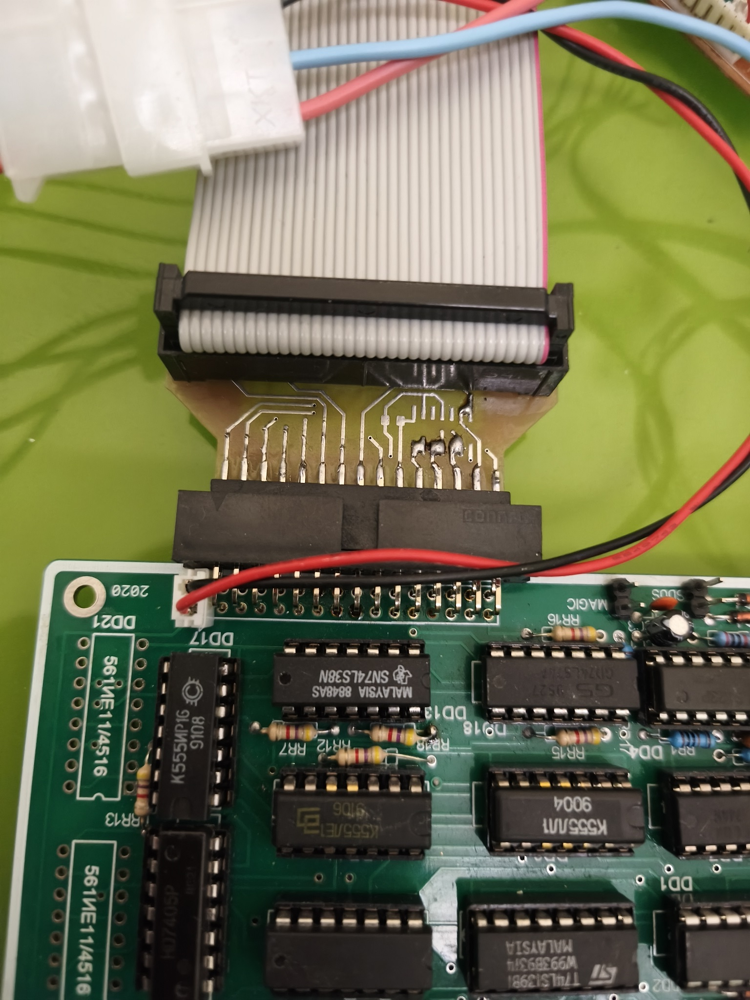

# Введение

Этот проект представляет собой переходник на стандартный интерфейс флоппи-дисковода
для ZX-Spectrum-совместимого компьютера "Пентагон-48". Для классических вариантов
платы, не имеющих буферизации линий выбора дисковода, предусмотрена возможность
установки буфера 74LS07. Если у вас есть этот буфер на плате, вы можете просто
замкнуть накоротко соответствующие дорожки.

# Рекомендации по сборке и подключению

Данный переходник использует 30-контактный разъём со стороны Пентагона, хотя на плате
компьютера посадочное место под разъём 32 контакта. Это сделано по двум соображениям.
Во-первых, стандартные разъёмы IDC имеются только под 30 контактов. Во-вторых, подача
питания через разъём дисковода на весь компьютер - не очень хорошая идея из-за тонких
дорожек. Поэтому я принял решение использовать 30-контактный разъём для данных и
отдельный 2-контактный разъём для подачи питания 12В. В качестве последнего хорошо
подходит разъём JST EHR-2

